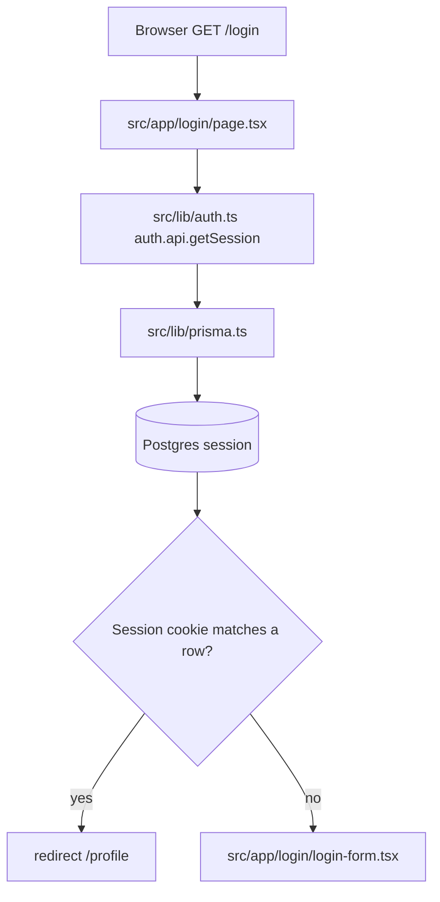
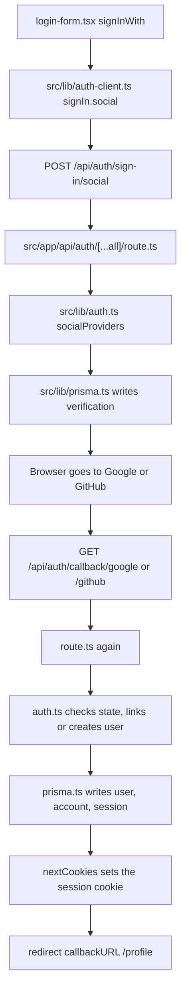
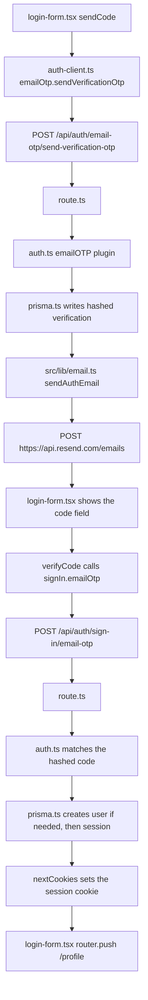
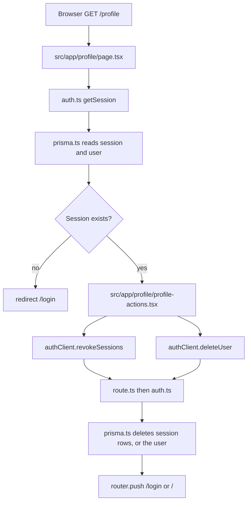

# Better Auth, Prisma 7, and Postgres

Study notes for how Ragnalizer signs people in. This describes the code in this repo. It does not contain secrets.

Official references:

- [Better Auth installation](https://www.better-auth.com/docs/installation)
- [Better Auth with Next.js](https://www.better-auth.com/docs/integrations/next)
- [Better Auth Prisma adapter](https://www.better-auth.com/docs/adapters/prisma)
- [Better Auth database schema](https://www.better-auth.com/docs/concepts/database)
- [Email OTP plugin](https://www.better-auth.com/docs/plugins/email-otp)
- [Users and accounts](https://www.better-auth.com/docs/concepts/users-accounts)
- [Prisma ORM 7](https://www.prisma.io/docs/orm/v7)
- [Prisma 7 with Next.js](https://www.prisma.io/docs/guides/v7/frameworks/nextjs)

## What each piece does

| Piece | Role |
| --- | --- |
| Better Auth | Sign-in API, sessions, cookies, Google, GitHub, and email codes |
| Prisma 7 | Typed access to Postgres and the migration history |
| Postgres | Stores users, sessions, login methods, and one-time codes |
| Next.js route | Exposes Better Auth at `/api/auth/*` |
| Resend | Sends the email that contains the sign-in code |

Better Auth does not talk to Postgres by itself here. It calls Prisma. Prisma uses the `pg` driver adapter, which is required in Prisma 7.

## Packages

Runtime:

- `better-auth`
- `@better-auth/prisma-adapter`
- `@prisma/client@7`
- `@prisma/adapter-pg`
- `pg`
- `dotenv`

Development:

- `prisma@7`
- `@types/pg`

`package.json` scripts:

- `npm run generate` runs `prisma generate`
- `npm run migrate` runs `prisma migrate dev`
- `postinstall` also runs `prisma generate`, so a fresh install can typecheck

The Better Auth CLI (`npx auth@latest generate`) wrote `prisma/schema.prisma`. Prisma then created and applied the SQL migration. `auth migrate` is only for Better Auth's built-in Kysely adapter, so this project does not use it.

## Environment names

Values live in `.env`, which is gitignored. The names are listed in `.env.example`.

| Name | Used for |
| --- | --- |
| `DATABASE_URL` | Postgres connection string |
| `BETTER_AUTH_SECRET` | Encrypts and signs auth data. At least 32 characters. Generate with `openssl rand -base64 32` |
| `BETTER_AUTH_URL` | Public origin of this app, for example `http://localhost:3000` |
| `GOOGLE_CLIENT_ID` / `GOOGLE_CLIENT_SECRET` | Google OAuth. Optional until set |
| `GITHUB_CLIENT_ID` / `GITHUB_CLIENT_SECRET` | GitHub OAuth. Optional until set |
| `RESEND_API_KEY` / `EMAIL_FROM` | Sending the email OTP |

OAuth redirect URLs that must be registered with the provider:

- `http://localhost:3000/api/auth/callback/google`
- `http://localhost:3000/api/auth/callback/github`

`EMAIL_FROM` must be an address on a domain verified in Resend. While a domain is not verified, Resend's shared test sender is `onboarding@resend.dev`, and it can only deliver to the email that owns the Resend account. A value such as `noreply@onboarding@resend.dev` is not a valid address.

If `DATABASE_URL` uses `sslmode=require`, current `pg` treats that as full certificate verification. Supabase's chain can fail with Prisma error `P1011` (`self-signed certificate in certificate chain`). Append `uselibpqcompat=true` so `require` means "encrypt the connection" and restart the dev server. The Prisma client is cached in development, so an old process keeps the previous URL.

## File map

| File | Purpose |
| --- | --- |
| `prisma/schema.prisma` | Models Better Auth reads and writes |
| `prisma.config.ts` | Tells the Prisma CLI where the schema, migrations, and `DATABASE_URL` are |
| `prisma/migrations/` | SQL applied to Postgres |
| `src/lib/prisma.ts` | One shared `PrismaClient` |
| `src/lib/auth.ts` | Server auth configuration |
| `src/lib/auth-client.ts` | Browser auth client |
| `src/lib/email.ts` | Sends mail through Resend's HTTP API |
| `src/app/api/auth/[...all]/route.ts` | Catch-all handler for `/api/auth/*` |
| `src/app/login/page.tsx` | Sign-in page. Redirects to `/profile` when a session already exists |
| `src/app/login/login-form.tsx` | Google, GitHub, and email-code form |
| `src/app/profile/page.tsx` | Placeholder profile. Redirects to `/login` when signed out |
| `src/app/profile/profile-actions.tsx` | Sign out everywhere, and delete the account |
| `src/generated/prisma/` | Generated client. Gitignored and recreated by `prisma generate` |

## Prisma 7 connection

Prisma 7 does not put the database URL inside `schema.prisma`. The datasource block only names the provider:

```prisma
datasource db {
  provider = "postgresql"
}
```

`prisma.config.ts` loads `.env` and passes `DATABASE_URL` to the CLI for migrations. Application code passes the same URL to the driver adapter:

```ts
const adapter = new PrismaPg({ connectionString: process.env.DATABASE_URL });
export const prisma = new PrismaClient({ adapter });
```

`src/lib/prisma.ts` stores that client on `globalThis` outside production. Next.js hot reload would otherwise open a new pool on every save.

The generator writes the client to `src/generated/prisma`. Import it from `@/generated/prisma/client`.

## Tables

Better Auth needs four tables. The `User.email` column is unique, so one email is one person.

### `user`

The person. `User.id` is the id the rest of the app should use.

### `session`

One signed-in browser or device. `token` is unique. `userId` points at `User.id`. Deleting the user cascades and removes their sessions.

### `account`

One login method, not the person. The same user can have a GitHub row and a Google row.

| Column | Meaning |
| --- | --- |
| `id` | This row's id inside our database. Account APIs that ask for an account id want this |
| `providerId` | `google`, `github`, or `credential` |
| `accountId` | The id that provider assigned, such as GitHub's user id. Together with `providerId`, this identifies the external login |
| `userId` | The `User.id` this login belongs to |
| `accessToken`, `refreshToken`, `idToken` | Tokens for that provider only |

Unlinking GitHub deletes that account row. The user and their other login methods stay.

### `verification`

Short-lived records. Email OTP codes are stored here, hashed (`storeOTP: "hashed"`), and expire after 300 seconds. OAuth also uses this table to store state before the browser returns from Google or GitHub.

## File execution order

Two kinds of calls share the same auth config.

A server page imports `auth` from `src/lib/auth.ts` and calls `auth.api.getSession` in the same process. That path never leaves the server.

A browser button imports `authClient` from `src/lib/auth-client.ts`. That client sends HTTP to `/api/auth/*`. Next.js then runs `src/app/api/auth/[...all]/route.ts`, which hands the request to the same `auth` object. Better Auth picks the action from the path.

`nextCookies()` is the last plugin in `src/lib/auth.ts`. After a sign-in, it copies the session `Set-Cookie` onto the Next.js response.

### Opening `/login`



`page.tsx` also reads `GOOGLE_CLIENT_ID`, `GOOGLE_CLIENT_SECRET`, `GITHUB_CLIENT_ID`, and `GITHUB_CLIENT_SECRET`. It passes `googleEnabled` and `githubEnabled` into the form. The form does not read those secrets itself.

### Google or GitHub



The callback is a second request. `route.ts` runs again because every `/api/auth/*` URL uses that one file. `account.accountLinking` in `auth.ts` attaches the provider to an existing user when the email already exists and the provider is `google` or `github`.

### Email code



`auth-client.ts` must load `emailOTPClient()`. That plugin is what adds `emailOtp` and `signIn.emailOtp` on the client. The display name sent with the code is the part of the email before `@`, set in `verifyCode`.

### Opening `/profile`, signing out, deleting



`page.tsx` loads the session before `ProfileActions` renders. The buttons only call the client. `revokeSessions` removes every session for that user, including this browser. `deleteUser` removes the `user` row, and Postgres cascades `session` and `account`.

On the server, a page reads the session with:

```ts
const session = await auth.api.getSession({
  headers: await headers(),
});
```

`/login` redirects to `/profile` when that session exists. `/profile` redirects to `/login` when it does not. That check is the real protection. A cookie-only middleware check only proves that some cookie exists.

## Sign-in methods

Google and GitHub are added only when both the client id and secret are present. The login buttons stay disabled until then.

`accountLinking` is enabled, and `google` and `github` are trusted providers. If those providers return the same email, Better Auth attaches the new login to the existing user instead of creating a second person.

Email sign-in uses the `emailOTP` plugin:

1. The form calls `authClient.emailOtp.sendVerificationOtp({ email, type: "sign-in" })`.
2. Better Auth creates a hashed verification row and calls `sendVerificationOTP`.
3. `sendAuthEmail` posts the code to `https://api.resend.com/emails`.
4. The form calls `authClient.signIn.emailOtp({ email, otp, name })`.
5. A matching code creates the user on first use, or signs in the existing user. The display name is the part of the email before `@` because the form only asks for an email.

The client must include `emailOTPClient()`. Without that plugin, `authClient.emailOtp` and `authClient.signIn.emailOtp` are not there.

Sending the email is a background task. The HTTP route can return 200 while the server log still shows that Resend rejected the message. Check the terminal, not only the response status.

## Profile actions

`revokeSessions()` deletes every session for the current user, including the one in this browser, then the page goes to `/login`.

`deleteUser({ callbackURL: "/" })` is enabled in `auth.ts`. These users have no password, so Better Auth allows deletion when the session is fresh (the default fresh window is one day). Deleting the user cascades to `session` and `account`.

## Study order

1. Read `prisma/schema.prisma` and name which id is the person, which id is a login method, and which column points a login method at a person.
2. Read `src/lib/prisma.ts` and `prisma.config.ts` and notice that the URL is not in the schema.
3. Read `src/lib/auth.ts` and list what is stored for a Google sign-in versus an email-code sign-in.
4. Follow one button in `login-form.tsx` to the matching `/api/auth/...` path.
5. Read `profile/page.tsx` and explain why the session is loaded on the server before the buttons render.
